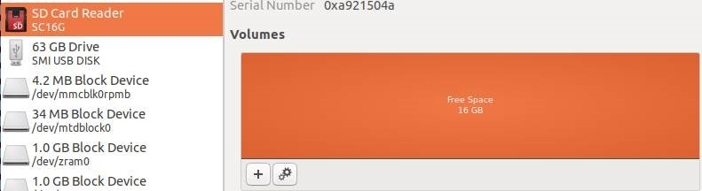
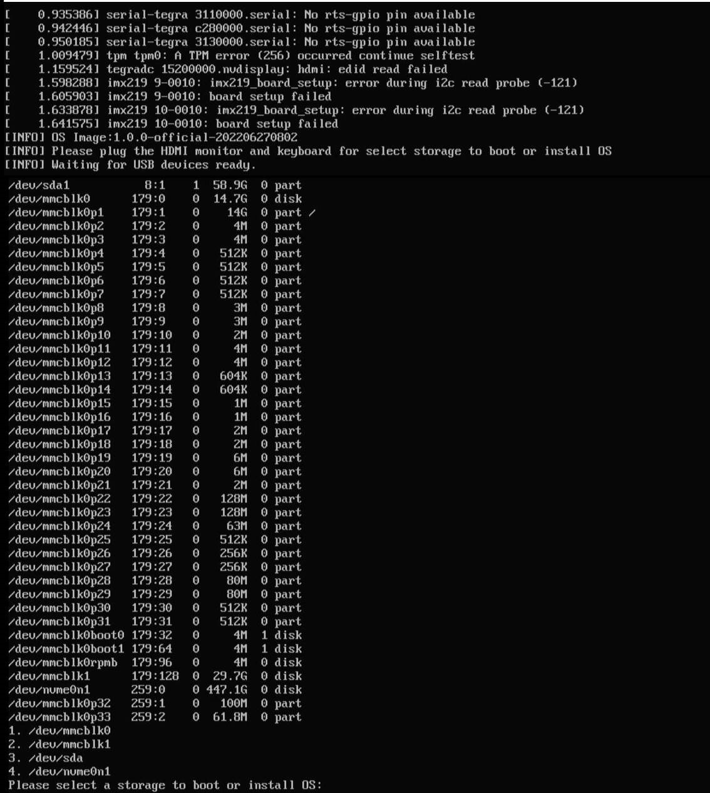
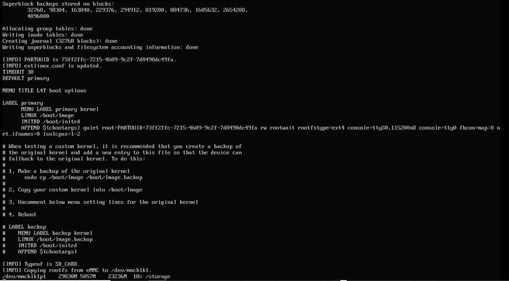
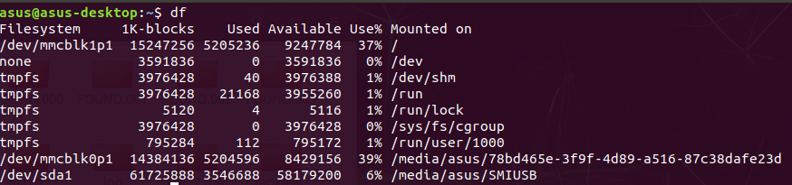

<div align="center">
  <p>
    <a align="center" href="https://ultralytics.com/yolov5" target="_blank">
      </a>
  </p>

[English](README.md) | [简体中文](README.zh-CN.md)
<br>

<div>
    <a href="https://github.com/ultralytics/yolov5/actions/workflows/ci-testing.yml"></a>
    <a href="https://zenodo.org/badge/latestdoi/264818686"></a>
    <a href="https://hub.docker.com/r/ultralytics/yolov5"></a>
    <br>
    <a href="https://bit.ly/yolov5-paperspace-notebook"></a>
    <a href="https://colab.research.google.com/github/ultralytics/yolov5/blob/master/tutorial.ipynb"></a>
    <a href="https://www.kaggle.com/ultralytics/yolov5"></a>
  </div>
  <br>

YOLOv5 🚀 is the world's most loved vision AI, representing <a href="https://ultralytics.com">Ultralytics</a> open-source research into future vision AI methods, incorporating lessons learned and best practices evolved over thousands of hours of research and development.

We hope that the resources here will help you get the most out of YOLOv5. Please browse the YOLOv5 <a href="https://docs.ultralytics.com/yolov5">Docs</a> for details, raise an issue on <a href="https://github.com/ultralytics/yolov5/issues/new/choose">GitHub</a> for support, and join our <a href="https://ultralytics.com/discord">Discord</a> community for questions and discussions!

To request an Enterprise License please complete the form at [Ultralytics Licensing](https://ultralytics.com/license).

<div align="center">
  <a href="https://github.com/ultralytics" style="text-decoration:none;">
    </a>
  
  <a href="https://www.linkedin.com/company/ultralytics/" style="text-decoration:none;">
    </a>
  
  <a href="https://twitter.com/ultralytics" style="text-decoration:none;">
    </a>
  
  <a href="https://youtube.com/ultralytics" style="text-decoration:none;">
    </a>
  
  <a href="https://www.tiktok.com/@ultralytics" style="text-decoration:none;">
    </a>
  
  <a href="https://www.instagram.com/ultralytics/" style="text-decoration:none;">
    </a>
  
  <a href="https://ultralytics.com/discord" style="text-decoration:none;">
    </a>
</div>

</div>
<br>

# <div align="left">Giới thiệu</div>
Hệ thống cảnh báo bất thường trên hành lang truyền tải điện. Sử dụng máy tính biên PE1000N Jetson Nano lắp sim 4G, kết nối hình ảnh với camera ip thông qua mạng LAN. Mô hình nhận dạng bất thường sử dụng YOLOV5.

# <div align="left">Cài đặt</div>

## <div align="left">Thẻ nhớ ngoài</div>
Thẻ nhớ ngoài microSD để tăng kích thước lưu trữ, do máy tính biên dung lượng mặc định thấp.

1. Mở Disk Manager để đảm bảo thẻ đã trống. Nếu chưa trống thì fomat thẻ, chọn định dạng chung với mọi dòng máy.

<div align="center">
<p></a></p>
<div align="left">

2. Tải, giải nén và copy initrd vào /boot của máy. <a href="https://drive.google.com/file/d/1gqImB_vn5pNrieii2KmhfCR_mn7NJd6h/view?usp=sharing">Link tải</a>. Sau khi tải thì sẽ nằm trong thư mục /Downloads. Chạy các lệnh sau:

    ```sh
    sudo unzip /home/xxx/Downloads/initrd_230707.zip
    sudo cp /home/xxx/Downloads/initrd_230707 /boot/initrd
    ```

3. Reboot máy

4. Sau khi reboot máy, khi khởi động lại máy sẽ hiển thị một màn hình có dạng tương tự dưới đây để chọn thẻ nhở mình vừa cài. Thẻ microSD hiển thị với đuôi là mmcblk1, nên chọn 2 như ví dụ trong ảnh dưới đây.

<div align="center">
<p></a></p>
<div align="left">

5. Ảnh dưới đây là tiến trình chạy sau khi chọn xong.

<div align="center">
<p></a></p>
<div align="left">

6. Sau khi chạy xong, gõ lệnh dưới đây trong terminal để kiểm tra kết quả.

    ```sh
    df
    ```

<div align="center">
<p></a></p>
<div align="left">


## <div align="left">Annaconda</div>
Annaconda dùng để tạo môi trường ảo cho việc cài đặt các thư viện lập trình.
